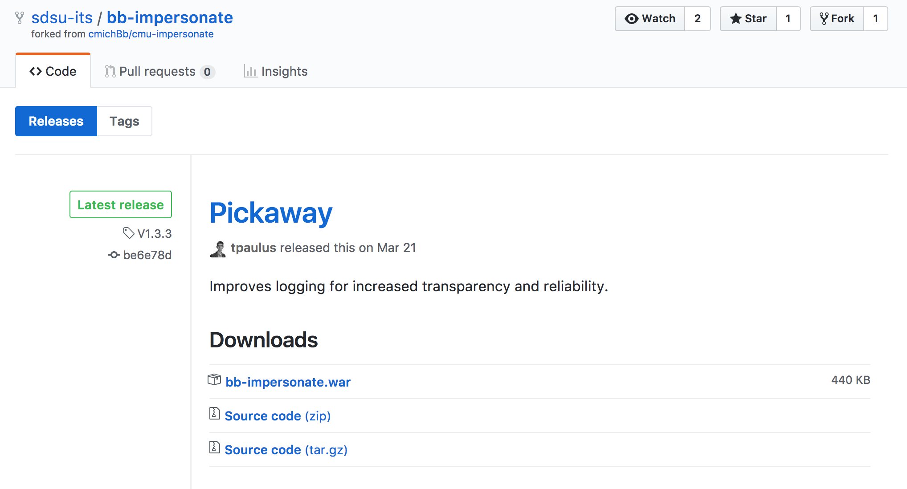

# Installation

The Impersonate Building Block can be installed just like any other Building Block \(commonly abbreviated to B2\) in Blackboard. The latest version of the B2 can be downloaded from SDSU ITS' GitHub - [https://github.com/sdsu-its/bb-impersonate/releases](https://github.com/sdsu-its/bb-impersonate/releases)

As a system administrator, from your Blackboard's Administrator Panel, upload the Building Block `.war` file under Building Blocks &gt; Building Blocks &gt; Installed Tools. Next choose **Upload Building Blocks**, and then upload the `bb-impersonate.war` file you downloaded from GitHub.

If you are upgrading the Impersonate B2, you will need to restart all application servers to ensure that all are using the most up to date version of the B2. If you experience issues with the B2 and are in a clustered deployment, the [amiup](https://community.blackboard.com/message/15741-re-knowing-which-app-server-you-are-on#comment-15741) utility maybe useful.

