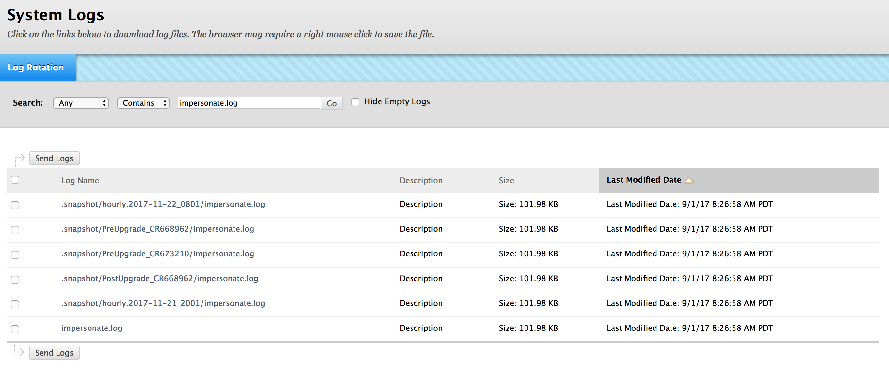

# Accessing Logs

Every time an Impersonate is attempted, a log entry is saved to the `impersonate.log` in Blackboard. Depending on your Blackboard Instance's log rotation settings, these may be backed up daily or weekly. Impersonate Logs can be retrieved similar to all other logs in Blackboard, from the Administrator Panel &gt; Tools and Utilities &gt; Logs. Impersonate logs are considered System Logs and are saved as such.



## Sample Log Output

```text
2017-09-01 08:26:14 INFO  Impersonate:55 - Impersonate Successful!
2017-09-01 08:26:14 WARN  impersonate_jsp:119 - "lwoods" is now impersonating "sponce_16"!
2017-09-01 08:26:26 WARN  Impersonate:92 - Impersonate User Level Check FAILED
2017-09-01 08:26:52 INFO  Impersonate:88 - Impersonate User Level Check Passed
2017-09-01 08:26:52 INFO  Impersonate:55 - Impersonate Successful!
2017-09-01 08:26:52 WARN  impersonate_jsp:125 - "sponce_16" is now impersonating "715305272"!
```

